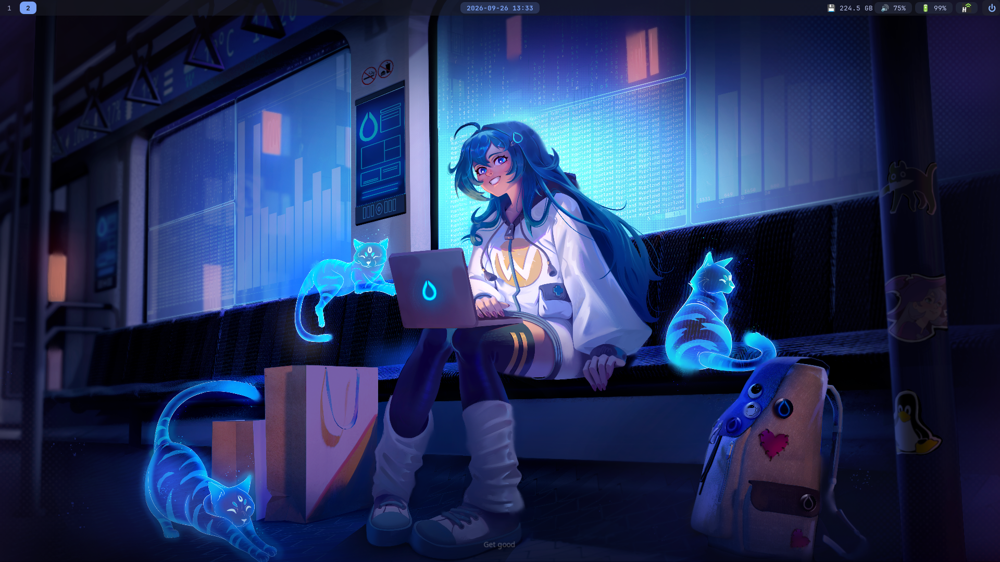
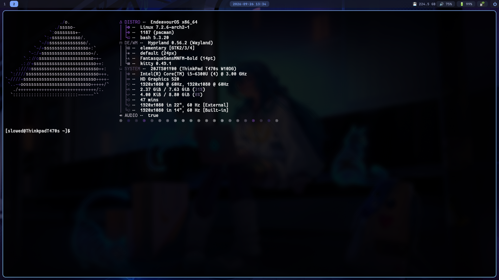

# 🌊 Hyprland Dotfiles — Capsule / Pill Aesthetic

Минималистичный и стильный конфиг для Hyprland с плавающей панелью Waybar, динамическим индикатором языка и меню управления мониторами на Wofi.

---

## 📸 Preview

<p align="center">
  
  
</p>

---

## 📦 1. Установка необходимых зависимостей

Перед использованием конфигурации убедитесь, что в системе установлены все нужные пакеты:

```bash
sudo pacman -S hyprland waybar wofi wlogout git

# 1. Клонируем репозиторий
git clone [https://github.com/travkatm/dotfiles.git](https://github.com/travkatm/dotfiles.git) ~/dotfiles

# 2. Копируем файлы конфигураций
cp -r ~/dotfiles/hypr ~/.config/
cp -r ~/dotfiles/waybar ~/.config/
cp -r ~/dotfiles/wofi ~/.config/
cp -r ~/dotfiles/wlogout ~/.config/

# 3. Делаем скрипты исполняемыми
chmod +x ~/.config/hypr/scripts/*

# 4. Перезагружаем Hyprland
hyprctl reload

✨ Особенности

    Capsule Aesthetic: Элементы Waybar и меню Wofi выполнены в стиле аккуратных закругленных капсул с синей рамкой (#7aa2f7).

    Динамический модуль языка: Автоматически переключает и отображает текущую раскладку (🌐 RU / 🌐 EN).

    Управление мониторами: Встроенный скрипт для переключения разрешений (включая форматы 4:3) для дисплеев 14" и 22" через удобное меню Wofi.
